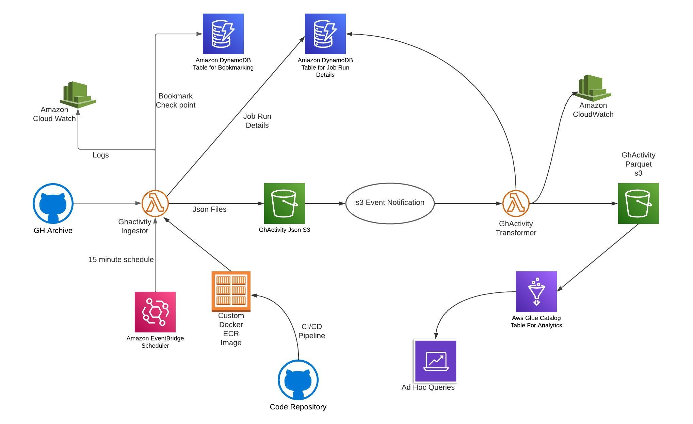

# GithubArchiveIngestor
- Lambda function Demonstration using Container Image, This Lambda function achieve following task

- Very Basic high level overview of this lambda function
1) Lambda function `Ghactivity_ingestor` Get Data from [GHArchive](https://www.gharchive.org/), save all json files to s3 table `(landing/ghactivity)`.
2) Lambda function `Ghactivity_transfomer` will be triggered automatically on `S3 PUT Event (landing/ghactivity)`
3) Lambda function `Ghactivity_transfomer` read all json files convert into `parquet file` and store on `S3 table raw/ghactivity/`
4) Create `Glue Crawler` to crawl incremental data to `Athena` table and run adhoc queries





- Create Lambda function in AWS console, set following Environment variable
Run : 
```
    
    
    Goto AWS CONSOLE SET ENVIRONMENT VAR Based on Need
    
    BUCKET_NAME : <YOUR_VAL>
    FOLDER: <YOUR_VAL>
    JOB_ID: <YOUR_VAL>
    SOURCE_FOLDER : <YOUR_VAL>
    TGT_FOLDER: <YOUR_VAL>
    JOB_ID_1: <YOUR_VAL>
    PYTHONPATH:/var/task/app
    
    

```
